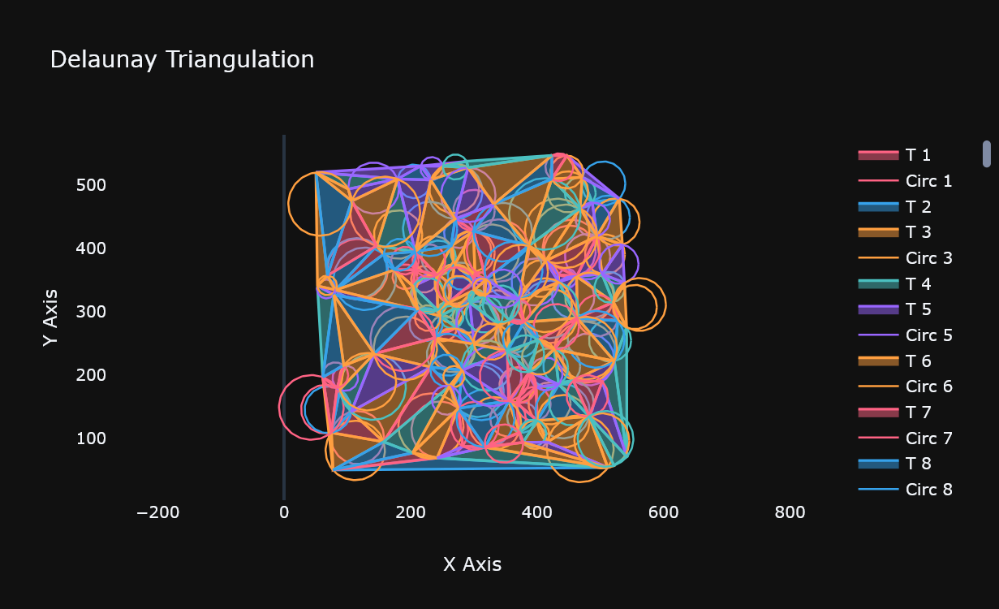
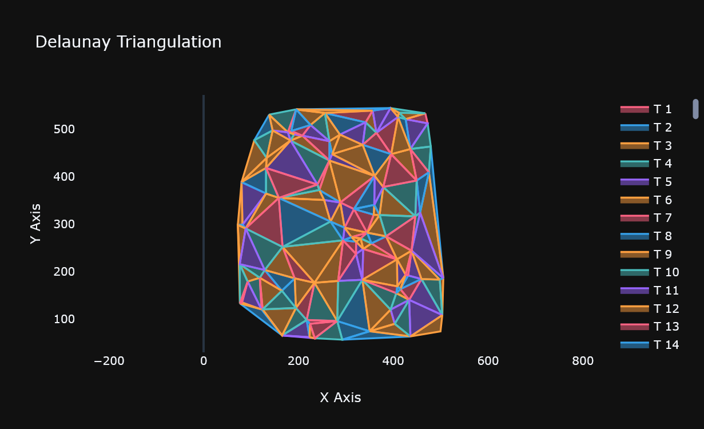

# Delaunay Triangulation in Rust

A Rust implementation of the Bowyer-Watson algorithm for Delaunay triangulation with interactive visualization using Plotly.

## Features

- **Bowyer-Watson Algorithm**: Efficient Delaunay triangulation implementation
- **Multiple Point Generators**: Random points, grid patterns, heart shapes, and diamond patterns
- **Visualization**: Interactive Plotly-based visualization with circumcircle display
- **Robust**: Handles edge cases and includes epsilon-based comparisons
- **Edge Case Handling**: Special handling for grid/regular point distributions

## Basic Usage

```rust
use delaunay_triangulation::{PointGenerator, BowyerWatsonTriangulator, PlotlyBuilder};

fn main() {
    // Generate random points
    let points = PointGenerator::random(10);
    
    // Compute Delaunay triangulation
    let triangles = BowyerWatsonTriangulator::compute(&points, true);
    
    // Visualize with circumcircles 
    let show_circumcircle = true;
    let skip_big_circumcircle = true;
    let _ = PlotlyBuilder::triangles(&triangles, show_circumcircle, skip_big_circumcircle);

    println!("point count: {:?}", points.len());
    println!("triangles: {:?}", triangles.len());
}
```

## Future CLI Interface (Coming Soon)  
**Generate Triangulation from Random Points**
```bash
delaunay-rust --points 100 --type random --output output.html
```

**Properties and Options:**

| Property                   | Value             | Description                                             | Default       |
| -------------------------- | ----------------- | ------------------------------------------------------- | ------------- |
| `--points`                 | `<integer>`       | Number of points to generate                            | *Required*    |
| `--type`                   | `random` `grid`   | Type of point distribution                              | `random`      |
| `--output`                 | `<filename>.html` | Output filename for visualization                       | `output.html` |
| `--shuffle`                | (flag)            | Randomize point processing order                        | `false`       |
| `--show-circumcircles`     | (flag)            | Show circumcircles in visualization                     | `false`       |
| `--skip-big-circumcircles` | (flag)            | Skip bigger than average circumcircles in visualization | `true`        |

**Note:** The `--shuffle` option controls whether points are processed in random order (better for general cases) or original order (better for deterministic/reproducible results).
 
## Examples
 
```rust
    let points = PointGenerator::random(100);
    let show_circumcircle = true;
    let skip_big_circumcircle = true;
```

 
```rust
    let points = PointGenerator::random(100);
    let show_circumcircle = false;
```


## Important Note on Regular Grids

When using perfectly regular grid points (like from `PointGenerator::square`), you may encounter issues with Delaunay constraints due to co-circular points. Possible safeguards, may be added in future.

## Output

The library generates interactive HTML visualizations showing:
- Triangulated mesh
- Optional circumcircles for each triangle
- Color-coded triangles for better visualization

## Algorithm Details

The implementation uses the Bowyer-Watson algorithm with:
- Super-triangle initialization for boundary handling
- Efficient edge polygon detection for hole retriangulation
- Circumcircle-based point location testing
- Proper cleanup of super-triangle vertices